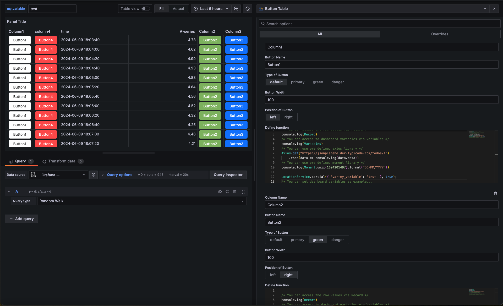
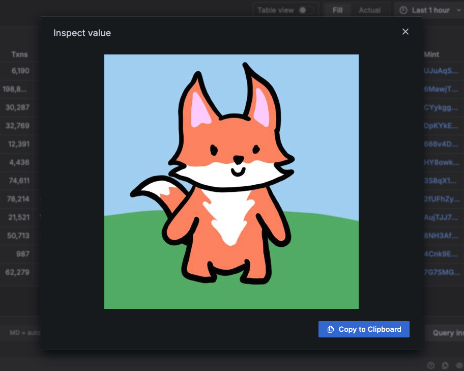

# Button Table

  

The Grafana Table Extended Plugin is an extension of the base Grafana table plugin with added features for enhanced functionality.

  

- **Add Button to Table:** Easily incorporate interactive buttons within your tables for seamless user interaction.

- **Value Inspect for Images:** Enable image inspection within the table for better visualization and analysis.



## Manual Installation Guide

 #### Download the Plugin
	 Download the latest release of the Button Table Plugin from this [URL](https://).
 #### Place the Plugin in the Grafana Plugins Folder

 1. Extract the downloaded plugin zip file.
 2. Locate your Grafana installation directory.
	  - If you installed Grafana manually: Find the directory where Grafana is installed.
	  - If you are using Docker: Locate the Grafana Docker container.
 3. Copy the extracted plugin folder into the Grafana plugins directory. 
	  - For manual installations: Place the plugin folder in `<grafana_installation_directory>/data/plugins`.
	  - For Docker: Mount the plugin folder into the container, typically done by adding a volume to the Docker run command.
#### Configuration

##### For Instance Grafana
1. Open the Grafana configuration file (`grafana.ini`). This file is usually located in the Grafana installation directory.
2. Add the following lines to your `grafana.ini` file:
	  ```
	allow_loading_unsigned_plugins = ick-buttontable-panel
	```
3. Save the `grafana.ini` file.

##### For Grafana Docker Image
If you are using Grafana via Docker, you need to configure the Docker run command to include the plugin.
1. Locate your Docker run command or Docker Compose file.
2. Add a volume to mount the plugin folder into the Grafana container.
	Example Docker run command:
	```bash
	docker run -d -p 3000:3000 --name=grafana -v {/path/to/plugin/folder}:/var/lib/grafana/plugins/ick-buttontable-panel grafana/grafana:latest
	```
	
	Replace `/path/to/plugin/folder` with the path to the plugin folder on your host machine.
3. Add following lines to your docker_compose.yaml file:
	```bash
	environment:
		NODE_ENV: development
		GF_LOG_LEVEL: debug
		GF_PLUGINS_ALLOW_LOADING_UNSIGNED_PLUGINS: ick-buttontable-panel
	```
5. Restart the Grafana Docker container.

#### Restart Grafana
After placing the plugin in the correct directory and configuring Grafana, restart Grafana to apply the changes.

## Setup Development

### Frontend
1. Install dependencies
```bash
npm install --legacy-peer-deps
```
2. Build plugin in development mode and run in watch mode
```bash
npm run dev
```
3. Build plugin in production mode
```bash
npm run build
```
4. Run the tests (using Jest)
```bash
# Runs the tests and watches for changes, requires git init first
npm run test
# Exits after running all the tests
npm run test:ci
```
5. Spin up a Grafana instance and run the plugin inside it (using Docker)
```bash
npm run server
```
6. Run the linter
```bash
npm run lint
# or
npm run lint:fix
```